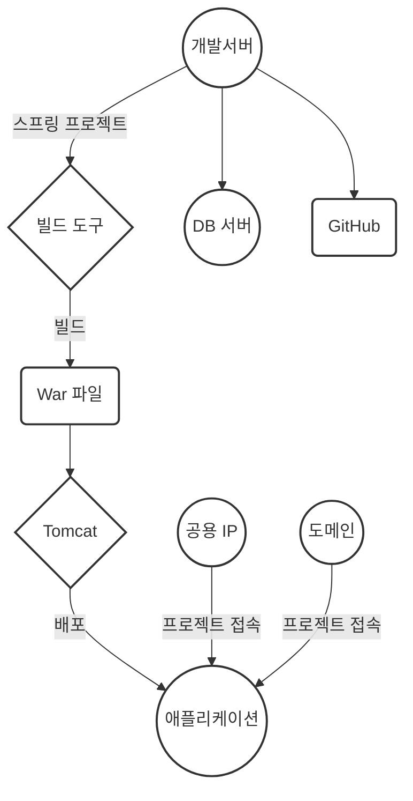

# 🎯 [MyBoard.site](http://MyBoard.site/) : 수정중입니다.
<br>
<br>
<br>

### 🌈 개요
> 가족이 함께하는 추억 공유 플랫폼입니다.<br>
> 멀리 떨어져 있는 가족 구성원들끼리 손쉽게 일정을 공유하고 소중한 기념일을 함께 기록하여 소중한 추억을 나눌 수 있는 공간입니다.<br>
> 더불어, 가족들끼리 추천하는 맛집이나 여행지를 소개하고 소통할 수 있어요.<br>
> 이를 통해 가족 간의 소중한 순간을 함께 공유하고 소통하며, 멀리 떨어져 있어도 유대감을 강화합니다.<br>
> 현재는 기본적인 회원관리, 게시글 작성, 댓글 작성 기능을 구현하여 사용자들이 서비스를 이용할 수 있습니다.<br>
<br>
<br>
<br>

### 🚀 서비스
>주요기능은 현재 게시글관리, 댓글관리가 있으며 업데이트 중입니다.
<br>
<br>


> 게시판:<br>
> 게시물 작성 기능: 사용자가 텍스트와 사진을 포함한 게시물을 작성할 수 있습니다.<br>
> 게시물 목록 페이지: 모든 게시물의 간단한 내용을 목록 형태로 보여주는 페이지를 제공합니다.<br>
> 상세보기 기능: 개별 게시물의 상세 내용과 해당 글의 모든 댓글을 볼 수 있는 페이지를 구현합니다.<br>
> 댓글 작성 기능: 사용자는 게시물에 댓글을 작성하고 답글을 달 수 있습니다.<br>
> 검색 기능: 게시물을 검색하는 기능을 제공하여 사용자가 원하는 내용을 쉽게 찾을 수 있도록 합니다.<br>
<br>
<br>


> 회원관리:<br>
> 회원 가입 기능: 새로운 사용자가 서비스에 가입할 수 있도록 회원 가입 기능을 구현합니다.<br>
> 로그인 기능: 이미 가입한 사용자가 서비스에 로그인하여 자신의 정보를 관리하고 서비스를 이용할 수 있도록 합니다.<br>
> 회원 정보 수정 기능: 사용자는 자신의 개인 정보를 수정할 수 있는 기능을 제공받습니다.<br>
> 비밀번호 변경 기능: 사용자는 자신의 계정 비밀번호를 변경할 수 있는 기능을 이용할 수 있습니다.<br>
> 회원 탈퇴 기능: 사용자가 회원 탈퇴를 원할 경우, 회원 탈퇴 기능을 제공하여 사용자의 정보를 안전하게 삭제합니다.<br>

### 권한<br>
| 기능        | 비회원 | 회원  |
|----------|-----|-----|
| 게시글(작성, 수정, 삭제) | ❌️  | ⭕️  |
| 댓글(작성, 수정, 삭제)  | ❌   | ⭕️  |
| 회원정보(로그인/로그아웃, 수정, 탈퇴)     | ❌   | ⭕️  |
| 게시글,댓글 보기  | ⭕️   | ❌  |
<br>
<br>
<br>

### 📚 Skill Stack
---

#### 📜 FRONT-END


<br>

#### 🛠️ BACK-END


<br>

#### 📀 DB


<br>

#### ✂️ Tool


<br>

#### 🌐 배포 




<br>
<br>
<br>

```mermaid
graph LR;
    subgraph 개발(Development)
        A[소스 코드] --> B(빌드);
    end

    subgraph 빌드(Build)
        B --> C(WAR 파일);
    end

    subgraph 테스트(Test)
        C --> D{테스트};
    end

    subgraph 배포(Deployment)
        D --> E{상용 서버 배포};
    end

    subgraph 운영(Production)
        E --> F(웹 서버);
        E --> G(데이터베이스 서버);
    end

    style 개발 fill:#FFD966,stroke:#333,stroke-width:2px;
    style 빌드 fill:#4CAF50,stroke:#333,stroke-width:2px;
    style 테스트 fill:#2196F3,stroke:#333,stroke-width:2px;
    style 배포 fill:#f44336,stroke:#333,stroke-width:2px;
    style 운영 fill:#00BCD4,stroke:#333,stroke-width:2px;


<br>
<br>

<hr>

#### 🧲DB ERD


<br>

🧲 [Use Case](https://github.com/sujins0311/Board/wiki/UseCase) <br>
🧲 [시퀀스다이어그램](https://github.com/sujins0311/Board/wiki/시퀀스다이어그램) <br>
🧲 [Front](https://github.com/sujins0311/Board/wiki/화면설계)<br>
 
<br>
<br>

<!-- 
### 🧲 프로젝트 중점사항
- 버전관리
- 문서화
- 공통되는 기능은 AOP로 분리


- 로그인 기능 추상화 
- 스프링의 @Transactional 이용하여 ㅇㅇ 과 ㅇㅇ 로직 구현
- github를 사용하여 CI/CD 환경 구축
- Docker를 이용하여 CD 구현
- Mysql Replication – AOP를 이용하여 Master/Slave로 데이터베이스 이중화
- Nginx의 Reversed-Proxy를 이용하여 로드밸런싱
-->
<!-- 🧲
### 📆 개발 일정 요약본

---

```mermaid
gantt
    title 2023.05.30 - 2023.07.03
    dateFormat X
    axisFormat %s
    section 기획
        구상: -2, 3
    section 기능 구현
        Develop: 2, 24
    section 테스트
        Test & BugFix: 20, 29
    section 배포
        AWS: 27, 33
```

<br>
<br>
-->
