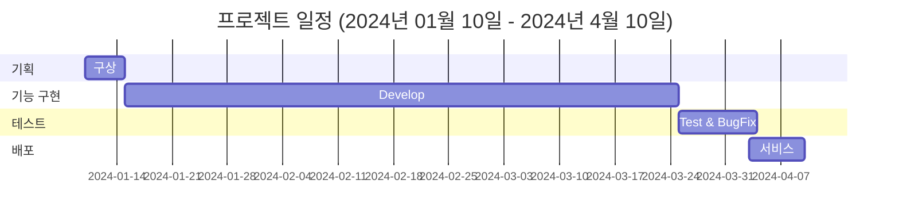

# [https://ppoosumi.me](https://ppoosumi.me/)
 
 
 

### 💡 개요 및 목적
> 이번 프로젝트는 "게시판을 통한 백엔드 구조 실습"입니다. 
> 이 프로젝트는 백엔드 개발 과정을 체계적으로 이해하고 익히기 위한 실습을 목적으로 합니다. 
> 프로젝트는 백엔드 개발에서 배포까지의 구조와 프로세스의 이해도를 높이는 것을 목적으로 시작했습니다. 
> 게시판 기능을 가진 웹 어플리케이션을 구축하여 데이터 베이스 관리부터 보안 및 배포까지의 과정을 경험하고자 합니다. 
> 그리고 버전 관리 시스템을 활용하여 코드를 관리하고, 코드아래 주석을 추가하고, 코드 및 시각적 자료를 블로그에 포스팅을 하여 문서화하였습니다. 
> 이를 통해 백엔드 개발의 기본적인 역량을 향상 시킬 수 있는 능력을 키워 나갈 계획입니다. 
 

> 이 프로젝트를 통해 제가 어떤 역량을 가지고 있는지를 보여드리고자 합니다. 
> 취업을 향한 제 열정과 노력을 함께 느끼어 주시면 감사하겠습니다. 
 
 
 

### 🚀 서비스
>주요기능은 현재 게시글관리, 댓글관리, 회원관리가 있으며, 업데이트 중입니다.
 
 

> 게시판: 
> 게시물 작성 기능: 사용자가 텍스트와 사진을 포함한 게시물을 작성할 수 있습니다. 
> 게시물 목록 페이지: 모든 게시물의 간단한 내용을 목록 형태로 보여주는 페이지를 제공합니다. 
> 상세보기 기능: 개별 게시물의 상세 내용과 해당 글의 모든 댓글을 볼 수 있는 페이지를 구현합니다. 
> 댓글 작성 기능: 사용자는 게시물에 댓글을 작성하고 답글을 달 수 있습니다. 
> 검색 기능: 게시물을 검색하는 기능을 제공하여 사용자가 원하는 내용을 쉽게 찾을 수 있도록 합니다. 
 
 

> 회원관리: 
> 회원 가입 기능: 새로운 사용자가 서비스에 가입할 수 있도록 회원 가입 기능을 구현합니다. 
> 로그인 기능: 이미 가입한 사용자가 서비스에 로그인하여 자신의 정보를 관리하고 서비스를 이용할 수 있도록 합니다. 
> 회원 정보 수정 기능: 사용자는 자신의 개인 정보를 수정할 수 있는 기능을 제공받습니다. 
> 회원 탈퇴 기능: 사용자가 회원 탈퇴를 원할 경우, 회원 탈퇴 기능을 제공하여 사용자의 정보를 안전하게 삭제합니다. 

#### 권한 

| 기능        | 비회원 | 회원  |
|----------|-----|-----|
| 게시글(작성, 수정, 삭제) | ❌️  | ⭕️  |
| 댓글(작성, 수정, 삭제)  | ❌   | ⭕️  |
| 회원정보(로그인/로그아웃)     | ❌   | ⭕️  |
| 게시글,댓글 보기  | ⭕️   | ❌  |

 
 
 

   
<b>📚 Skill Stack </b>
   
    
#### 📜 FRONT-END

    
 
    
#### 🛠️ BACK-END

    
 
    
#### 📀 DB

    
 
    
#### ✂️ Tool

   
 

#### 🌐 개발 및 배포 구조도 

 

#### 📆 개발 일정 요약본

 

#### 🗃️ DB ERD

 

 

   
<b>*️⃣ 시퀀스다이어그램 </b>

   
   
   #### 게시글 전체 조회
   

    

   #### 게시글 수정
   

    
   
   #### 게시글 검색
   

    

 

   
<b>*️⃣ Front </b>

   

 

   
<b>*️⃣ Use Case </b>
 
    

   ## User

   **회원 가입 기능:**
   - 사용자는 회원으로 가입하기 위해 필요한 정보를 입력합니다.
   - 회원으로 가입하기 위해 필요한 정보는 아이디, 비밀번호, 전화번호, 이메일, 주소입니다.
   - 사용자가 입력한 아이디는 중복되지 않아야 합니다.
   
   **로그인 기능:**
   - 이미 가입한 사용자는 서비스에 로그인하여 자신의 정보를 관리하고 서비스를 이용할 수 있습니다.
   
   **회원 정보 수정 기능:**
   - 사용자는 자신의 개인 정보를 수정할 수 있습니다.
   
   **비밀번호 변경 기능:**
   - 사용자는 자신의 계정 비밀번호를 변경할 수 있습니다.
   
   **회원 탈퇴 기능:**
   - 사용자가 회원 탈퇴를 원할 경우, 회원 정보를 안전하게 삭제하고 회원 탈퇴합니다.
   
    
   
   ## Board
   **게시물 작성 기능:**
   - 사용자는 텍스트와 사진을 포함한 게시물을 작성할 수 있습니다.
   
   **게시물 목록 페이지:**
   - 모든 게시물의 간단한 내용을 목록 형태로 보여줍니다.
   - 페이지마다 일정한 개수의 게시물이 표시되며, 다음 페이지로 이동할 수 있는 페이징 기능이 제공됩니다.
   
   **상세보기 기능:**
   - 개별 게시물의 상세 내용과 해당 글의 모든 댓글을 볼 수 있습니다.
   
   **댓글 작성 기능:**
   - 사용자는 게시물에 댓글을 작성하고 답글을 달 수 있습니다.
   
   **검색 기능:**
   - 게시물을 검색하는 기능을 제공하여 사용자가 원하는 내용을 쉽게 찾을 수 있습니다.

 

 

<b> 🎯 프로젝트 개발 일지</b>

- **1차**
    - 게시판 생성,읽기,수정,삭제 -- 완료
    - 검색 -- 완료
    - 페이징 -- 완료
    - https 적용 -- 완료
    - UI/UX 1차 업데이트 -- 완료
    - 로그인, 권한, 접근제어 -- 완료
    - 회원가입, 회원정보 수정 -- 작업 중
    - 첨부파일 업로드 및 다운로드 -- 작업 예정
    - 상세검색 -- 작업 예정
    - 에디터 연동 -- 작업 예정
    - 본문이미지 -- 작업 예정
    - 이메일인증 -- 작업 예정
    - 패스워드 찾기 및 변경 -- 작업 예정
    - UI/UX 2차 업데이트 -- 작업 예정
    - 새 글 알림 (websocket) -- 작업 예정
    - 구글 OTP 연동 -- 작업 예정
    - 다국어 -- 작업 예정
    - 관리자챗 (websocket) -- 작업 예정
    - oauth2 연동 -- 작업 예정
    - CI/CD -- 작업 예정
    - 웹서버 적용, 이중화, 세션통합관리 -- 작업 예정
    - 각 기능 고도화 및 리팩토링 -- 작업 예정
    - 백엔드 테스트 케이스 작성 -- 작업 예정

  
