# 🎯 [MyBoard.site]
<!-- (http://MyBoard.site/) --> 
 
 
 

### 🌈 개요 및 목적
> 이번 프로젝트는 "게시판을 통한 백엔드 구조 실습"입니다. 
> 이 프로젝트는 백엔드 개발 과정을 체계적으로 이해하고 익히기 위한 실습을 목적으로 합니다. 
> 프로젝트는 백엔드 개발에서 배포까지의 구조와 프로세스의 이해도를 높이는 것을 목적으로 시작했습니다. 
> 게시판 기능을 가진 웹 어플리케이션을 구축하여 데이터 베이스 관리부터 보안 및 배포까지의 과정을 경험하고자 합니다. 
> 그리고 버전 관리 시스템을 활용하여 코드를 관리하고, 코드아래 주석을 추가하고, 코드 및 시각적 자료를 블로그에 포스팅을 하여 문서화하였습니다. 
> 이를 통해 백엔드 개발의 기본적인 역량을 향상 시킬 수 있는 능력을 키워 나갈 계획입니다. 
 

> 이 프로젝트를 통해 제가 어떤 역량을 가지고 있는지를 보여드리고자 합니다. 
> 취업을 향한 제 열정과 노력을 함께 느끼어 주시면 감사하겠습니다. 
 
 
 

### 🚀 서비스
>주요기능은 현재 게시글관리, 댓글관리가 있으며 업데이트 중입니다.
 
 

> 게시판: 
> 게시물 작성 기능: 사용자가 텍스트와 사진을 포함한 게시물을 작성할 수 있습니다. 
> 게시물 목록 페이지: 모든 게시물의 간단한 내용을 목록 형태로 보여주는 페이지를 제공합니다. 
> 상세보기 기능: 개별 게시물의 상세 내용과 해당 글의 모든 댓글을 볼 수 있는 페이지를 구현합니다. 
> 댓글 작성 기능: 사용자는 게시물에 댓글을 작성하고 답글을 달 수 있습니다. 
> 검색 기능: 게시물을 검색하는 기능을 제공하여 사용자가 원하는 내용을 쉽게 찾을 수 있도록 합니다. 
 
 

<!--
> 회원관리: 
> 회원 가입 기능: 새로운 사용자가 서비스에 가입할 수 있도록 회원 가입 기능을 구현합니다. 
> 로그인 기능: 이미 가입한 사용자가 서비스에 로그인하여 자신의 정보를 관리하고 서비스를 이용할 수 있도록 합니다. 
> 회원 정보 수정 기능: 사용자는 자신의 개인 정보를 수정할 수 있는 기능을 제공받습니다. 
> 비밀번호 변경 기능: 사용자는 자신의 계정 비밀번호를 변경할 수 있는 기능을 이용할 수 있습니다. 
> 회원 탈퇴 기능: 사용자가 회원 탈퇴를 원할 경우, 회원 탈퇴 기능을 제공하여 사용자의 정보를 안전하게 삭제합니다. 

### 권한 
| 기능        | 비회원 | 회원  |
|----------|-----|-----|
| 게시글(작성, 수정, 삭제) | ❌️  | ⭕️  |
| 댓글(작성, 수정, 삭제)  | ❌   | ⭕️  |
| 회원정보(로그인/로그아웃, 수정, 탈퇴)     | ❌   | ⭕️  |
| 게시글,댓글 보기  | ⭕️   | ❌  |
 
 
 
-->

### 📚 Skill Stack
---

#### 📜 FRONT-END

 

#### 🛠️ BACK-END

 

#### 📀 DB

 

#### ✂️ Tool

 

#### 🌐 배포 

 

### 📆 개발 일정 요약본

```mermaid
gantt
    title 2023.11.30 - 2024.01.31
    dateFormat X
    axisFormat %s
    section 기획
        구상: 0, 5
    section 기능 구현
        Develop: 5, 65
    section 테스트
        Test & BugFix: 65, 75
    section 배포
        가비아도메인: 75, 105
```

 

 
<!-- 
기획: 5일
기능 구현: 60일
테스트: 10일
배포: 30일
-->

#### 🧲DB ERD

 

 

🧲 [Use Case](https://github.com/sujins0311/Board/wiki/UseCase)  
🧲 [시퀀스다이어그램](https://github.com/sujins0311/Board/wiki/시퀀스다이어그램)  
🧲 [Front](https://github.com/sujins0311/Board/wiki/화면설계) 

 
<!-- 
### 🧲 프로젝트 중점사항
- 버전관리
- 문서화
- 공통되는 기능은 AOP로 분리

- 로그인 기능 추상화 
- 스프링의 @Transactional 이용하여 ㅇㅇ 과 ㅇㅇ 로직 구현
- github를 사용하여 CI/CD 환경 구축
- Docker를 이용하여 CD 구현
- Mysql Replication – AOP를 이용하여 Master/Slave로 데이터베이스 이중화
- Nginx의 Reversed-Proxy를 이용하여 로드밸런싱
-->
